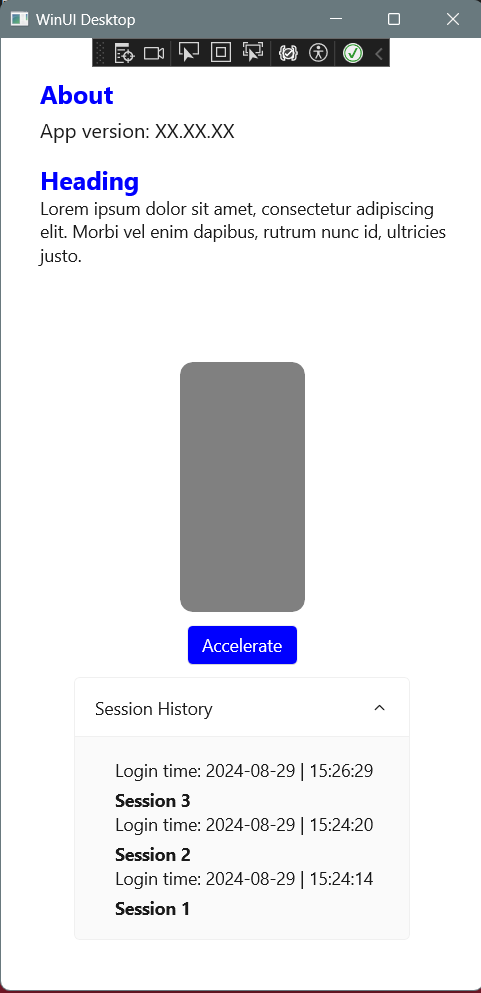
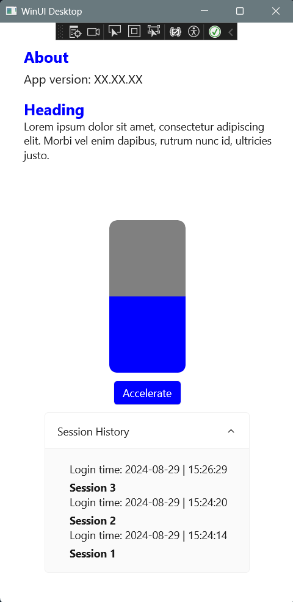

# PixelPaw - A WinUI 3 Sample Application
This is a basic WinUI 3 application.

## Prerequisites
- Visual Studio 2022 with the following workloads:
- .NET desktop development
- Desktop development with C++


## Getting Started
1. Clone the Repository:
```
git clone https://github.com/NIXBLACK11/pixelpaw.git
cd pixelpaw
```
2. Open the Solution:
- Open PixelPaw.sln in Visual Studio.
3. Build and Run:
- Press F5 to build and run the application.


## To simply install use this:
[installer](PixelPasInstaller\Debug\PixelPasInstaller.msi)

These are the screenshots of my solution:

